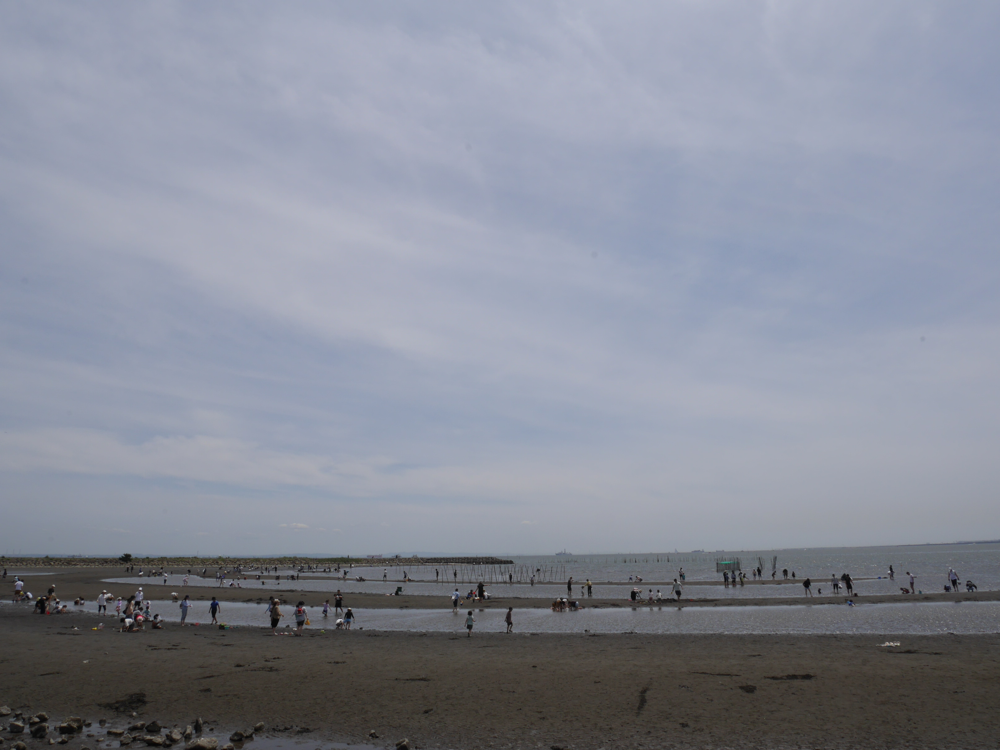

# 🌊 Welcome to QurhtDvf's Beachside Kitchen

  

  <b>ᚲᚢᚱᛏ ᛞᛖᚠᛟᚠ</b> 
  <b>QurhtDvf</b> 
  /kuːt dəˈvøːf/

### 統計学と機械学習、LLM
* [統計学](https://github.com/QurhtDvf/statistics)  ← 理論体系（原理層）
    * 不確実性のもとでデータから構造を推定するための理論体系
* 機械学習 ← 方法論（アルゴリズム層）
    * 統計的原理を計算機上で実現するための方法論。有限データから未知データへの予測能力を獲得するアルゴリズム体系として、統計学の概念を最適化問題へと具体化。
* [LLM（大規模言語モデル）](https://github.com/QurhtDvf/llm) ← 特定モデル族（実装層）
    * 機械学習の枠組み（主に深層学習）の中で構築された特定のモデル族。大量のテキストデータから言語のパターンや構造を学習し、生成・理解を行う。

### 🍱 Dagens Råvarer (Dagens Ingredients)

Vores køkken håndterer et bredt udvalg af friske råvarer:

*   **🐍 Python & Jupyter** - Frisk og letanrettet
*   **🦀 Rust** - Robust og langtidsholdbar 
*   **🌀 Julia** - Hurtig og kraftfuld 
*   **🛠 C++** - Traditionel og solid
  
### 🍹 Today's Menu (Introduction)

こんにちは！ここは私のオープンキッチン（リポジトリ）です。

